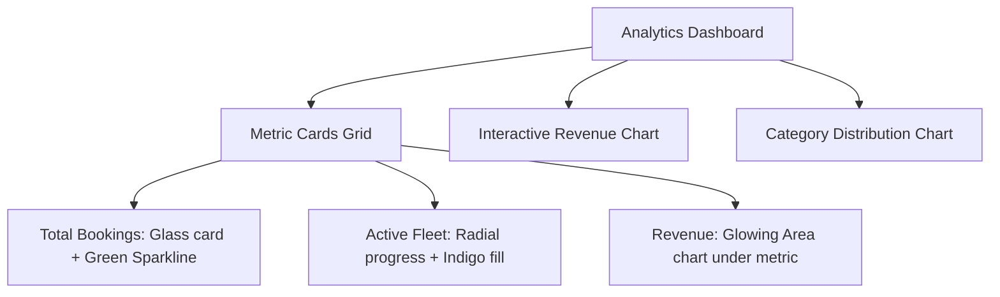

# 🌌 Veloce CMS: Next-Gen Glassmorphic Admin Dashboard & CMS
> **Master Technical & Design Specification Document**  
> *Prepared for: Aim Car Travels / travelwebsite2*  
> *Target Stack: React + Vite + TypeScript + Tailwind CSS + shadcn/ui + Supabase*

---

## 🎨 1. Global Design System (Glassmorphism & Vibrancy)

To create an outstanding, premium interface that feels alive and premium, we establish a **Glassmorphic Dark Mode** design system.

### 🌈 Color Palette (Tailwind Configuration Tokens)
```js
// tailwind.config.ts extension
theme: {
  extend: {
    colors: {
      brand: {
        dark: "#080710",       // Deep velvet-space background
        card: "rgba(255, 255, 255, 0.03)", // Glass card background
        border: "rgba(255, 255, 255, 0.08)", // Translucent border
        glow: "rgba(99, 102, 241, 0.15)", // Indigo ambient glow
      },
      neon: {
        cyan: "#00F2FE",       // Active, metrics increase
        violet: "#9B51E0",     // Premium tags, branding
        pink: "#FF007A",       // Alert, deletion, critical warning
        green: "#39FF14",      // Enabled, live status, booking confirmed
        amber: "#FFB000",      // Pending actions, draft mode
      }
    },
    backdropBlur: {
      xs: "2px",
      card: "20px",
    }
  }
}
```

### ✨ Glassmorphism CSS Utility Specifications
Add these rules inside `src/index.css` to build beautiful glassmorphic surfaces:
```css
/* Glass Card Base Style */
.glass-panel {
  background: linear-gradient(
    135deg,
    rgba(255, 255, 255, 0.03) 0%,
    rgba(255, 255, 255, 0.01) 100%
  );
  backdrop-filter: blur(20px);
  -webkit-backdrop-filter: blur(20px);
  border: 1px solid rgba(255, 255, 255, 0.08);
  box-shadow: 0 8px 32px 0 rgba(0, 0, 0, 0.37);
  transition: all 0.4s cubic-bezier(0.16, 1, 0.3, 1);
}

/* Glass Card Glowing Hover Effect */
.glass-panel-hover:hover {
  background: linear-gradient(
    135deg,
    rgba(255, 255, 255, 0.06) 0%,
    rgba(255, 255, 255, 0.02) 100%
  );
  border-color: rgba(99, 102, 241, 0.3);
  box-shadow: 0 12px 40px 0 rgba(99, 102, 241, 0.15);
  transform: translateY(-4px);
}

/* Glowing Neon Buttons */
.btn-neon-glow {
  position: relative;
  overflow: hidden;
  transition: all 0.3s ease;
}
.btn-neon-glow::after {
  content: '';
  position: absolute;
  top: 0;
  left: -50%;
  width: 200%;
  height: 100%;
  background: linear-gradient(
    to right,
    transparent,
    rgba(255, 255, 255, 0.1),
    transparent
  );
  transform: skewX(-25deg);
  transition: 0.75s;
}
.btn-neon-glow:hover::after {
  left: 125%;
}
```

### 💫 Micro-Animations & Transitions (Framer Motion Tokens)
- **Card Entry Grid**: Staggered fade-up (`duration: 0.5s`, `ease: [0.16, 1, 0.3, 1]`)
- **Interactive Toggles**: Bounce-back scale (`whileTap={{ scale: 0.95 }}`)
- **Tab Switching**: Underline layout transitions (`layoutId="activeTab"`)

---

## 📐 2. Information Architecture & Page Layouts

### 🗂️ Global Sidebar Navigation (The Hub)
- **Header**: Glassmorphic brand container with an animated rotating glowing accent border.
- **Main Nav Items**:
  - `Overview` (Interactive Analytics)
  - `Branding & Theme` (Global CMS)
  - `Fleet Manager` (Car CRUD)
  - `Review Manager` (Testimonials)
  - `WhatsApp Copy` (Templates)
  - `Payment & QR` (Settings)
- **Footer**: Minimizable User/Admin avatar with custom logout dropdown.

---

## 📈 3. Component & Section Specifications

### 📊 A. Overview & Analytics Dashboard
This page features fully colorful, interactive glassmorphic graphs using Recharts.



#### Metrics Component Design Specs:
- **Card Design**: Translucent background, top-right neon highlight dot, bottom-left numeric value, bottom-right micro sparkline showing the 7-day trend.
- **Interactive Revenue Chart**:
  - **Type**: Double area-spline chart (Revenue vs. Page Views).
  - **Aesthetics**: Indigo area gradient (`opacity: 0.2` to `0.0`), Cyan line strokes (`strokeWidth: 3`), grid lines styled with `.brand-border`.
  - **Tooltips**: Dynamic, floating glassmorphic panels displaying current value.

### 🚗 B. Fleet / Car Management
- **Layout**: Grid cards with visual hover effects.
- **Card Actions**: Toggle availability status directly from the card (using an optimistic UI switch), Edit details modal, Delete with a two-step confirm-popover.
- **Sort & Filter**: Responsive sticky filter bar (Search, Category Filter dropdown, Availability toggle).

### ✍️ C. Live Content & Review Editor
- **Features**:
  - **Hero Slider Section Content Editor**: Input fields with real-time preview of the title and subtitle as it will appear on the landing page.
  - **Review Card CMS**: A visual catalog of user reviews with custom initial circles. Supports instant active/inactive switches, and up/down sorting options.

---

## 🗄️ 4. Supabase Database & Security (RLS) Schema

Ensure the database is initialized with this secure and clean schema:

```sql
-- Create App Role Enum
CREATE TYPE public.app_role AS ENUM ('admin', 'user');

-- User Roles Mapping Table
CREATE TABLE public.user_roles (
  id uuid PRIMARY KEY DEFAULT gen_random_uuid(),
  user_id uuid NOT NULL REFERENCES auth.users(id) ON DELETE CASCADE,
  role app_role NOT NULL,
  created_at timestamptz NOT NULL DEFAULT now(),
  UNIQUE (user_id, role)
);

-- Enable RLS
ALTER TABLE public.user_roles ENABLE ROW LEVEL SECURITY;

-- Helper security function to verify role status
CREATE OR REPLACE FUNCTION public.has_role(_user_id uuid, _role app_role)
RETURNS boolean
LANGUAGE sql STABLE SECURITY DEFINER SET search_path = public
AS $$
  SELECT EXISTS (SELECT 1 FROM public.user_roles WHERE user_id = _user_id AND role = _role)
$$;

-- RLS Policies for User Roles
CREATE POLICY "Users can inspect own roles" ON public.user_roles FOR SELECT TO authenticated USING (auth.uid() = user_id);
CREATE POLICY "Admins have full command over roles" ON public.user_roles FOR ALL TO authenticated
  USING (public.has_role(auth.uid(), 'admin')) WITH CHECK (public.has_role(auth.uid(), 'admin'));

-- Site Settings Singleton Table
CREATE TABLE public.site_settings (
  id uuid PRIMARY KEY DEFAULT gen_random_uuid(),
  business_name text NOT NULL DEFAULT 'Aim Car Travels',
  tagline text NOT NULL DEFAULT 'Vijayawada',
  hero_title text NOT NULL DEFAULT 'Self-Drive Cars in Vijayawada',
  hero_subtitle text NOT NULL DEFAULT 'Well-maintained vehicles with transparent pricing.',
  phone_number text NOT NULL DEFAULT '+919492456488',
  whatsapp_number text NOT NULL DEFAULT '919492456488',
  address text NOT NULL DEFAULT 'Benz Circle, Vijayawada, AP',
  payment_qr_url text NOT NULL DEFAULT '',
  upi_id text NOT NULL DEFAULT '',
  updated_at timestamptz NOT NULL DEFAULT now()
);

-- Enable RLS on Settings
ALTER TABLE public.site_settings ENABLE ROW LEVEL SECURITY;
CREATE POLICY "Public reads settings" ON public.site_settings FOR SELECT USING (true);
CREATE POLICY "Admins update settings" ON public.site_settings FOR UPDATE TO authenticated
  USING (public.has_role(auth.uid(), 'admin')) WITH CHECK (public.has_role(auth.uid(), 'admin'));
```

---

## 🛠️ 5. Component Development Blueprints

### 🌌 Glassmorphic Card (Shadcn Customization)
Save as `@/components/ui/glass-card.tsx`:
```tsx
import * as React from "react"
import { cn } from "@/lib/utils"

export interface GlassCardProps extends React.HTMLAttributes<HTMLDivElement> {
  glowColor?: string
}

const GlassCard = React.forwardRef<HTMLDivElement, GlassCardProps>(
  ({ className, glowColor = "rgba(99, 102, 241, 0.15)", ...props }, ref) => {
    return (
      <div
        ref={ref}
        style={{
          boxShadow: `0 8px 32px 0 rgba(0, 0, 0, 0.3), 0 0 40px 0 ${glowColor}`
        }}
        className={cn(
          "relative overflow-hidden rounded-3xl border border-white/10 bg-white/[0.02] backdrop-blur-card p-6 transition-all duration-500 hover:border-white/20",
          className
        )}
        {...props}
      />
    )
  }
)
GlassCard.displayName = "GlassCard"

export { GlassCard }
```

### 💫 Glassmorphic Area Graph Blueprint (Recharts)
Save as `@/components/admin/AnalyticsGraph.tsx`:
```tsx
import { ResponsiveContainer, AreaChart, Area, XAxis, YAxis, Tooltip } from 'recharts';

const data = [
  { name: 'Mon', revenue: 4000, views: 2400 },
  { name: 'Tue', revenue: 3000, views: 1398 },
  { name: 'Wed', revenue: 9800, views: 9800 },
  { name: 'Thu', revenue: 2780, views: 3908 },
  { name: 'Fri', revenue: 1890, views: 4800 },
  { name: 'Sat', revenue: 2390, views: 3800 },
  { name: 'Sun', revenue: 3490, views: 4300 },
];

export const AnalyticsGraph = () => (
  <div className="w-full h-[350px] p-6 glass-panel rounded-3xl">
    <div className="flex justify-between items-center mb-6">
      <h3 className="text-lg font-semibold text-white">Revenue & Visits Overview</h3>
      <div className="flex gap-4 text-xs">
        <span className="flex items-center gap-1.5"><span className="w-2.5 h-2.5 rounded-full bg-neon-cyan inline-block"></span>Revenue</span>
        <span className="flex items-center gap-1.5"><span className="w-2.5 h-2.5 rounded-full bg-neon-violet inline-block"></span>Views</span>
      </div>
    </div>
    <ResponsiveContainer width="100%" height="90%">
      <AreaChart data={data}>
        <defs>
          <linearGradient id="colorRev" x1="0" y1="0" x2="0" y2="1">
            <stop offset="5%" stopColor="#00F2FE" stopOpacity={0.4}/>
            <stop offset="95%" stopColor="#00F2FE" stopOpacity={0}/>
          </linearGradient>
          <linearGradient id="colorViews" x1="0" y1="0" x2="0" y2="1">
            <stop offset="5%" stopColor="#9B51E0" stopOpacity={0.4}/>
            <stop offset="95%" stopColor="#9B51E0" stopOpacity={0}/>
          </linearGradient>
        </defs>
        <XAxis dataKey="name" stroke="#666" fontSize={12} tickLine={false} axisLine={false} />
        <YAxis stroke="#666" fontSize={12} tickLine={false} axisLine={false} />
        <Tooltip contentStyle={{ background: 'rgba(10, 10, 20, 0.85)', borderColor: 'rgba(255,255,255,0.1)', borderRadius: '16px', backdropFilter: 'blur(10px)' }} />
        <Area type="monotone" dataKey="revenue" stroke="#00F2FE" strokeWidth={3} fillOpacity={1} fill="url(#colorRev)" />
        <Area type="monotone" dataKey="views" stroke="#9B51E0" strokeWidth={3} fillOpacity={1} fill="url(#colorViews)" />
      </AreaChart>
    </ResponsiveContainer>
  </div>
);
```

---

## 🚀 6. Developer Agent Execution Instructions
Use the checklist below to guide the development agent during execution:
- [ ] Install framer-motion, lucide-react, and recharts.
- [ ] Configure `tailwind.config.ts` to extend the brand color/glow system as described in Section 1.
- [ ] Create `@/components/ui/glass-card.tsx` as your primary container component.
- [ ] Build the interactive Sidebar (`src/pages/admin/AdminLayout.tsx`) with dynamic active states.
- [ ] Put the `AnalyticsGraph` into `Overview.tsx` to serve as the dashboard's hero element.
- [ ] Test the database connections and ensure RLS policies match the specifications in Section 4.
